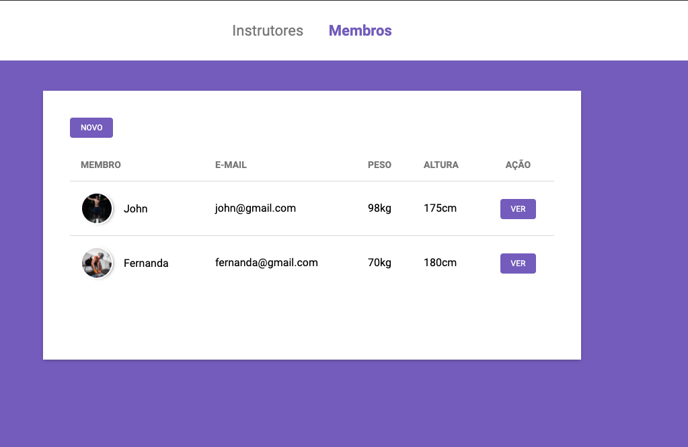

## :muscle: Gym Academy
Gerencie instrutores e membros da sua academia. :running:



## :rocket: Tecnologias

- [Node Js](https://nodejs.org/en/)
- [Nunjucks](https://mozilla.github.io/nunjucks/)

## :fire: Instalação
```bash
$ git clone https://github.com/ClodoaldoDantas/gym-academy.git
$ cd gym-academy
$ npm install
$ npm run dev
```

### :mortar_board: Quem ministrou o projeto ?
- [Mayk Brito](https://github.com/maykbrito)

---

Feito com ❤️ by Clodoaldo Dantas
